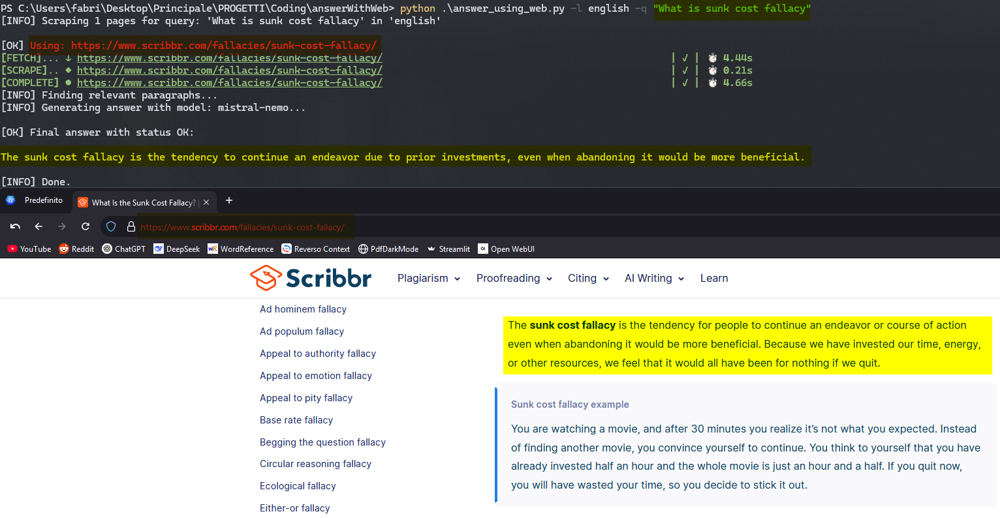
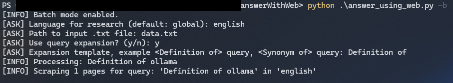

# Answer with Web

Answer with web offers a way of getting higher-quality AI answers by supplying the LLM with relevant content scraped from the web.
It works similarly to the *Chat GPT web search* feature, but runs locally — no rate limits, no subscriptions required.

Here is what it does:

- Scrapes web pages based on a user query using a search engine (Google or DuckDuckGo).
- Extracts relevant content from the scraped pages.
- Uses a large language model (LLM) to generate a final answer based on the extracted content.

You can run it even in batch mode with a list of queries and the output will be a CSV file with the answers generated. This may be a good choice for creating **Anki decks**.

Example use case: Suppose you have a list of terms and want to learn their definitions.
You can use this tool to retrieve accurate definitions for each term.

The main advantage is that the response will be more reliable than a standard LLM interaction, because the model is forced to use information extracted from the web. This greatly reduces the risk of hallucinations, more common on open source and small models.


## Examples of Usage

### Single query



### Batch Mode




#### Output

```csv
Definition of ollama;Ollama is a machine learning platform that democratizes access to large language models (LLMs) by enabling users to run them locally on their machines. It offers a user-friendly interface and seamless integration capabilities for various applications in AI and natural language processing.
Definition of mysql;MySQL is an open-source relational database management system that uses SQL for managing and manipulating data. It is developed by Oracle Corporation and supports multiple platforms like Windows, Linux, and macOS.
Definition of torch python;PyTorch is an open-source deep learning library built on Python, providing GPU acceleration, dynamic computation graphs, and an intuitive interface for researchers and developers. It follows a "define-by-run" approach with flexible model execution and debugging using dynamic graphs.
Definition of type casting in C;Type casting in C is converting one data type to another using the casting operator (e.g., `(int)` or `(float)`. It's used when a variable's datatype needs changing for specific operations. There are two main types: explicit (forced conversion) and implicit (automatic conversion).
```

This file is ready to be imported into Anki.


## Install

- Requires Python 3.10 or higher and pip.

- Requires Ollama installed and running on your machine.

- Download torch with CUDA SUPPORT from https://pytorch.org/get-started/locally/, select your os specs and copy the command. If you don't have a GPU the execution will still work but of course it will be slower.
Example of installation on Windows:

```bash
pip install torch torchvision torchaudio --index-url https://download.pytorch.org/whl/cu118
```

- Install the requirements:

```bash
pip install -r requirements.txt
```

- Setup web scraper

```bash
playwright install
crawl4ai-setup
crawl4ai-doctor
```
Ensure that at the end appears: `[COMPLETE] ● ✅ Crawling test passed!`

- Choose and download an Ollama model from https://ollama.com/search, this will be used to construct the final question.

- The next step is to configure the `config.json` file, see the configuration section below for details.

## Configuration

Here is the explanation of every parameter you can adjust in `config.json`:

- `llm_provider`: The provider of the large language model (LLM) to use for generating responses. Right now only `ollama` is supported.

- `final_answer_model`: The specific LLM model to use from the provider. For Ollama, this must match a model you have installed locally (get their names running `ollama list`). This model must be specified in the `all_llm_configs` section at the bottom as well.

- `retrieval_mode`: The method used for semantic retrieval of relevant content. Supported: `sentence_transformers`.

- `embedding_model`: Name of the embedding model used to convert text into vectors for semantic search. Example: `"Qwen/Qwen3-Embedding-0.6B"`. This model must be available on Hugging Face and will be downloaded automatically if not cached. Select an embedding model from https://huggingface.co/models?library=sentence-transformers, here is a rank for multilingual capabilities: https://huggingface.co/spaces/mteb/leaderboard

- `search_engine`: The web search engine used to retrieve documents. Supported: `google`, `ddg` (DuckDuckGo), `ddg_custom` which is my custom and simpler DuckDuckGo Scraper.

- `max_pages`: Maximum number of web pages to scrape for a given query. A higher value will increase the time required to scrape and process the content.

- `max_chunk`: Maximum number of relevant chunks to extract from the scraped document to be passed to the LLM.

- `save_content_to_file`: If `true`, saves the scraped content and selected chunks to local markdown files for inspection/debugging.

- `llm_template`: The prompt template used to instruct the LLM. It includes placeholders like `{language}`, `{question}`, and `{document}` that are filled at runtime. This guides the model to generate accurate, concise, and language-specific answers.

- `all_llm_configs`: A list of configurations for available LLM models (only ollama is supported). Each object must include:
  - `name`: The name of the model (must match what is used in `final_answer_model`)
  - `temperature`: Sampling temperature for the model (lower is more deterministic)
  - `thinking_enabled`: Set this to true if the model supports thinking steps (like `deepseek-r1`), which allows it to reason before answering, any thinking steps will not be included in the final answer.

### Guidelines

- A good temperature for the final answer model is around `0.2` to `0.4`, which balances creativity and accuracy.
- Consider using a higher `max_chunk` value if you have a model with a large context.
- Choose the best llm depending on the language you want to use, during my test I've found that `mistral-nemo` works well for Italian, `gemma3` performs well in English, but it may not be the best choice for other languages.
- You can modify llm behavior by adjusting the `llm_template`, for example, you can add more instructions to guide the model on how to answer the question.

Once the config file is completed, you can start using tool.

## Features

### Search engine region

It use a parameter to specify the region of the search engine, which can help in retrieving more relevant results based on your location or the language of the query.
This is specified by the `-l` parameter, which should match a language supported by the search engine.

### Search engine fallback

If somehow the search engine fails to retrieve results, the tool will try to use a different search engine to ensure that you still get relevant content. Example if google fails, it will try DuckDuckGo.

### Wikipedia enhanced scraping

Since Wikipedia is a common source of information, the tool has a special scraping method for Wikipedia pages that extracts text content more effectively than the standard web scraping.

### Query expansion

Query expansion is useful in batch mode, in order to save you time. If you have a **list of keywords** or phrases, you can use a query expansion template to generate more specific and informative queries for each item.

You can insert a prefix or full sentence (template) before each query to better contextualize it and improve the relevance of the results. Then it will run the same procedure for each template+keyword generated.

Example: `Meanings of` as a template will execute for each query `Meanings of {query}?`.

Other examples of templates you can use:

- Meanings of {query}?

- Explain in simple terms the concept of {query}

- Provide examples of {query}

- Opposite of {query}?

- Synonyms of {query}


### Response status

The tool provides a status for each response, indicating whether the answer was generated successfully, if it was based on web content, or if it was generated from the LLM without web content. This helps you understand the reliability of the answer.

- `status` can be one of the following:
  - `OK`: The answer was generated successfully.
  - `NO_WEB_CONTENT`: The answer was generated from the LLM without using web content.
  - `NO_RELEVANT_CHUNKS`: The retrieval did not find any relevant chunks from the web content. The answer will be based on the LLM without web content.


## Usage

### Single Query mode

```bash
python answer_using_web.py -l <language> -q "<query>"
```

- `-l` specifies the language used in the search engine and in the output response. It should match a language supported by the search engine.

Get the supported languages for the search engine you are using:

```bash
python .\answer_using_web.py --list-language
```

- `-q` is the question you want to ask. It should be in the language specified by `-l`.

## Batch Mode


Activate the batch mode:

```bash
python answer_using_web.py -b
```
It will ask:

- Specifies the language used in the search engine and in the output response. It should match a language supported by the search engine.
- The path to the input .txt file containing questions.
- The query expansion template (optional).

It will show at the end if some question has a status different than `OK`.

The output will be a CSV file with the answers generated (`question; answer`), saved in the same directory as the input file.


## Disclaimer


The possibile mistakes are:

- Web scarping fails to retrieve content due to bot-protection mechanisms or other issues.
- The retrieval process does not find relevant chunks, this is due to the input document and the embedding model.
- The LLM may generate answers that are not fully accurate or relevant, especially if the input question is ambiguous or lacks context.
- The quality is highly dependent on the LLM model used, so choose a model that is well-suited for your language and task. Do some tests with different models to find the best one for your needs.


